# Thermo Forge Unreal Plugin

## Overview

Thermo Forge is an Unreal Engine plugin for simulating and querying heat, climate, and thermal conditions in your levels.
It processes baked geometry fields such as sky openness, wall permeability, and indoor factors, then blends them with dynamic weather, altitude, and heat sources to produce realistic temperature values anywhere in the world.

The system is built around Thermo Forge Volumes and Heat Source Components, with a World Subsystem handling queries and composition. You can work directly with baked fields, introduce runtime sources, or retrieve composed temperatures through both Blueprints and C++.

Thermo Forge is designed for seamless gameplay integration, from AI “heat sense” behaviors to environment-driven mechanics. It is efficient, editor-friendly, and requires no engine modifications or physics assets. Instead, it models environmental interaction through the concept of porosity, the relationship between material volume and surrounding space. This is used to approximate permeability and how heat dissipates or propagates in real-world conditions.

The system is baked and lightweight, relying on precomputed fields for efficiency while applying runtime adjustments for climate, diurnal cycles, elevation, and occlusion. Dynamic heat sources remain fully interactive, enabling believable changes such as a fire cooling its surroundings when extinguished.

Thermo Forge is still under development but has been proven stable in both open-world and smaller test environments. It has been validated with multiple overlapping volumes, dense grids, and complex level layouts. While experimental in nature, it is carefully designed, tested, and refined with the aid of AI supervision to ensure clarity, code quality, and reliability.

A demo with plugin in action can be found here -> [Thermo Forge Demo UE5 Project](https://github.com/cem-akkaya/ThermoForgeDemo)

If you have any bug or crash, please open an issue in the Github repo.
If you have suggestions, questions or need help to use you can always contact [me](https://github.com/cem-akkaya) 

If you want to contribute, feel free to create a pull request.

## Features

- Volume-based thermal field baking (sky view, wall permeability, indoor proxy).
- Climate simulation with diurnal cycles, seasons, altitude lapse rate, and weather scaling.
- Heat Source components (point or box) with configurable intensity, falloff, and attenuation.
- Query functions for current temperature at any world position with given UTC.
- EQS and Thermal Events for AI.
- Grid previews and heat visualization in-editor.
- Subsystem for managing sources and accessing thermal data globally.
- Blueprint and C++ integration for gameplay-driven heat logic.

## Examples

Some examples of Thermo Forge plugin in action:

|  |  |
|:--------------------------------------------:|:--------------------------------------------:|
| Grid previews and heat visualization in-editor with default density settings. Multiple sources, blocking geometry, and occlusion simulate heat distribution. | Top-down view of heat distribution in a level with multiple sources and geometry, influenced by season, occlusion, and weather. |

|  |  |
|:--------------------------------------------:|:--------------------------------------------:|
| Multiple heat sources across volumes with gradual dispersion and constant temperature options. | Day and night temperatures automatically adjust based on the time of day and weather. |

|  |  |
|:--------------------------------------------:|:--------------------------------------------:|
| Seasons and weather affect level temperature with UTC-based location and seasonal shift settings. | Closed areas are automatically occluded, giving brief temporal dispersion and making interiors cooler or more insulated. |

|      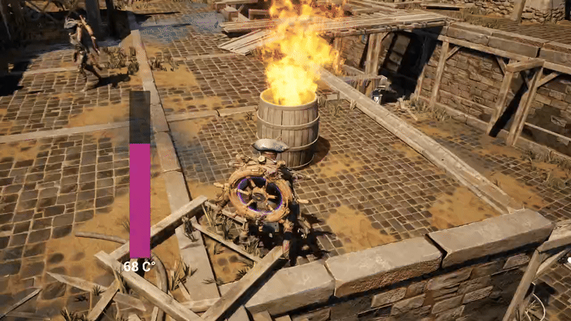      |                                                                                              |
|:------------------------------------------------------:|:----------------------------------------------------------------------------------------------------------------------------------------:|
| Sources are also dynamically affected apart from bake. | A simple AI logic checking temperature and upon reaching below 10 Celcius,using AI EQS to thermal sources using baked Thermo Forge data. |

|                                                                                                                                                                                                                                                                   |
|:-------------------------------------------------------------------------------------------------------------------------------------------------------------------------------------------------------------------------------------------------------------------------------------------------------------:|
| Dynamic Heat Reactive Material with Custom Data Channels driven the values around Thermo Forge HeatFX Component. Once it is attached the actor and material master is used, data channels drive heat aspects out of box. Lightweight usage and fully applicable to open worlds without custom gameplay logic. |

|                                                                                                                                                          |
|:-----------------------------------------------------------------------------------------------------------------------------------------------------------------------------------------------------:|
| Thermal Vision Post Process In  action. Demo material can be found under plugins resources, uses probe sampling  to achieve expected results, can be fully customised via c++ blueprints or material. |

## Installation
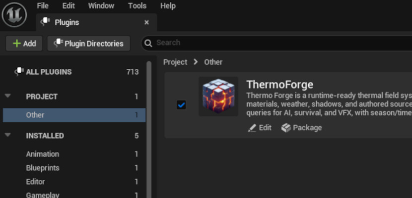

Install it like any other Unreal Engine plugin.
- Place ThermoForge under `Drive:\YOURPROJECTFOLDER\Plugins\ThermoForge`
- Activate it in your project’s Plugins menu
- Open the **Thermo Forge Tab** from `Tools > Thermo Forge`
- Use **Spawn Thermal Volume** to add a volume into the level
- Resize the volume like a normal Brush/Box actor
- Use the **preview buttons** to rebuild or visualize the baked grid
- Click **Kickstart Sampling** in the tab to generate baked data for all volumes
- Select any actor and press **Add Heat Source** to attach a ThermoForgeSource component
- Configure the source with shape, radius, intensity, and falloff in the Details panel
- In Blueprints or C++, use the **Thermo Forge Subsystem** to query temperature at any world position

## Detailed Usage

- **Project Settings**
    - Open **Edit > Project Settings > Thermo Forge**
    - Set climate defaults (winter/summer averages, day-night deltas, solar gain)
    - Configure altitude lapse and sea level if needed
    - Adjust permeability rules (air density, max solid density, absorption, trace channel)
    - Define default grid cell size and guard cells for volumes
    - Choose preview defaults (time of day, season, weather)
  
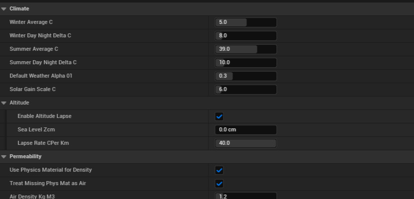

- **Thermo Forge Tab**
    - Found under **Tools > Thermo Forge**
    - **Spawn Thermal Volume**: Adds a new Thermo Forge Volume into the level
    - **Add Heat Source to Selection**: Adds a ThermoForgeSource component to selected actor(s)
    - **Kickstart Sampling**: Bakes geometry fields for all volumes in the level
    - **Show All Previews**: Makes all grid previews visible
    - **Hide All Previews**: Hides all grid previews
    - **Set Mesh Insulated**: Applies the Thermo Forge insulator physical material to selected meshes

- **Thermo Forge Volume**
    - Place a volume in your level using the tab or manually from the class list
    - Adjust **BoxExtent** to fit the area you want sampled
    - Toggle **bUnbounded** to let the volume cover the entire level
    - Choose grid settings (use global grid, custom cell size, grid origin mode, orientation)
    - Preview options (gap size, auto-rebuild, max instances, preview material)
    - Assign or inspect baked field assets (automatically generated during sampling)   
    - Use **Rebuild Preview Grid**, **Build Heat Preview**, or **Hide Preview** buttons in Details

- **Heat Source Component**
    - Add to any actor using the Thermo Forge Tab or manually in the Details panel
    - Toggle **Enabled** to activate/deactivate the source
    - Set **Intensity (°C)** to define temperature offset at the center
    - Choose **Shape**: Point (sphere) or Box (oriented)
    - Configure size: **RadiusCm** for point, **BoxExtent** for box   
    - Pick a **Falloff** method (None, Linear, Inverse Square) for point sources
    - Toggle **AffectByOwnerScale** to scale source with the actor’s transform   
    - Sources are registered automatically in the World Subsystem.

- **Blueprint / C++ Integration**
    - Blueprint: Drag from Thermo Forge Subsystem to call query nodes   
    - C++: Include `ThermoForgeSubsystem.h` and use subsystem functions  
    - Use `OnSourcesChanged` delegate to react when new heat sources are added/removed

- **Thermal Probes and Thermal Sampling**
    - Thermal sampling for gameplay and tech art solvers are made on `UpdateThermalProbesAndUpload()` in subsystem
    - You can directly call function from blueprints on tick to update probes when necessary
    - A Thermal Vision Post Process is available under `Plugins/ThermoForge/Resources/ThermoForgeVisionPP_M`
    - It uses probe sampling to achieve expected results, can be fully customised via c++ blueprints or material.
    - Probe variables are defined in `ThermalVisionPostProcess.h` and exposed to blueprints, can be passed to materials as parameters.

### Thermo Forge Subsystem
- **Subsystem & Queries** 
  - Access via **Thermo Forge Subsystem** (World Subsystem)
  - ComputeCurrentTemperatureAt(WorldPosition, bWinter, TimeHours, WeatherAlpha) to calculate exact temperature 
  - QueryNearestBakedGridPoint(WorldPosition, QueryTimeUTC) to get nearest baked cell info  
  - QueryNearestBakedGridPointNow(WorldPosition) for real-time queries 
  - Subsystem also provides helper functions for occlusion, ambient rays, and data dumping

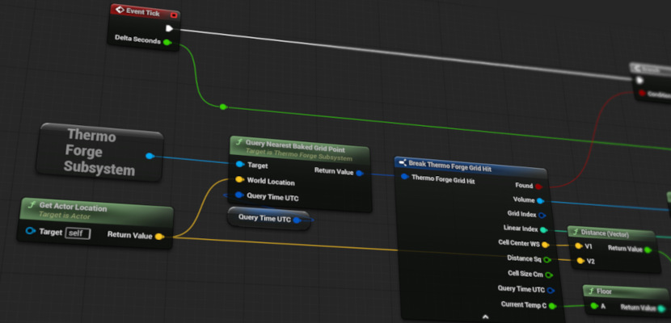

### Thermo Forge AI Helpers
- ** AI EQS Test (Environment Query)**   
  - Class: **Thermo: Temperature (°C)** (`UAIEQS_Thermal`)   
  - Add as a test in an EQS Query asset   
  - Filter by **Min/Max °C** to keep only points within a temperature band   
  - Score hotter, colder, or center-of-band locations  

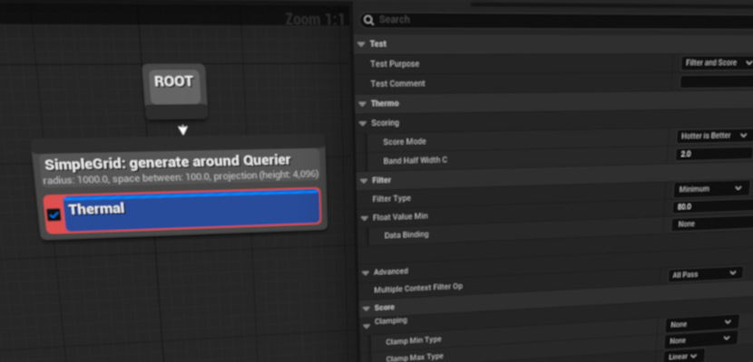

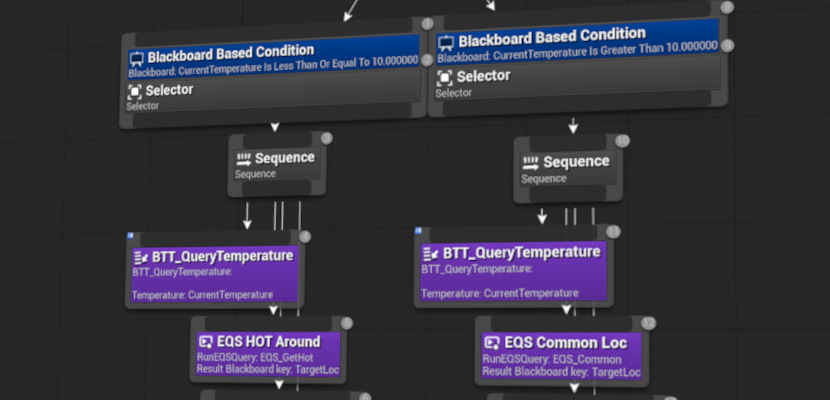

- **Thermal Sense (AI Perception)**   
  - Config: **AI Sense Thermal** (`UAISenseConfig_Thermal`)   
  - Attach to an **AIPerceptionComponent** on your AI character
  - Samples **ambient temperature** at the listener’s location at configurable intervals
  - Designer options: sensing ranges, update cadences (near/mid/far), spherical or FOV cone shape
  - Threshold (°C above ambient) defines when a stimulus is registered
  - Supports **Line of Sight** occlusion and **Emitter Tag** filtering
  
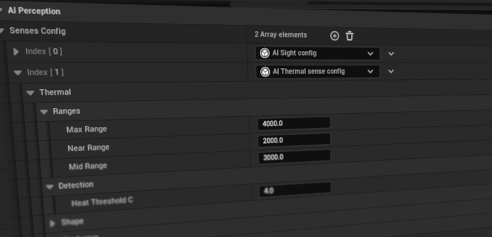

- **Thermal Events**
  - Events appear as thermal stimuli in AI Perception
  - Strength is mapped relative to the configured detection threshold   
  - Supports optional **Instigator** actor and **Tag** for filtering or debugging
  - Useful for one-shot spikes such as fires, explosions, overheating, or cold spots

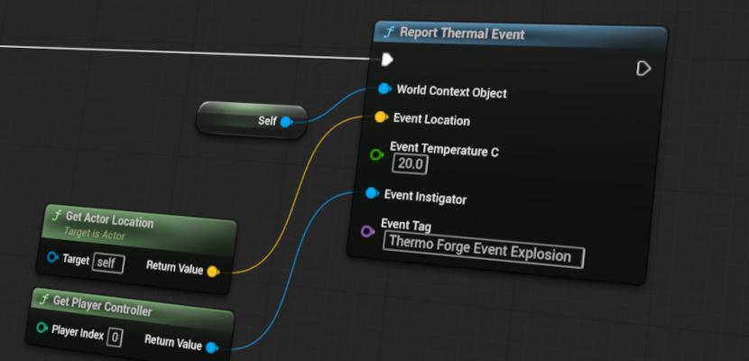

- **Heat FX Component**

  - Attaches to any actor, if have a Static Mesh Component can write Heat values into Custom Primitive Data.
  - Detects surrounding heat sources and creates events on threshold changes.
  - Supports optional **Instigator** actor and **Tag** for filtering or debugging
  - Useful for one-shot spikes such as fires, explosions, overheating, or cold spots.
  - A demo material is available with plugin under Resources **/Content/ThermoForgeFX_M** graphs can read Heat, Falloff, and Distance directly via scalar/vector parameters
  - Typical use: drive emissive color, distortion, or particle spawning based on nearby heat sources resulting in thermal reactive materials by default.
  - Updates automatically as the owning actor or surrounding thermal field changes
  - Debug preview available through CPD defaults (in the component inspector)

If you want component to directly write custom data channels, write Component Name and check the box.
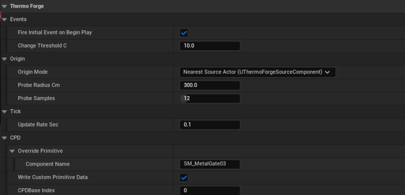

If you want to write custom data channels, in blueprint and material setup you can define the channels you want to write.
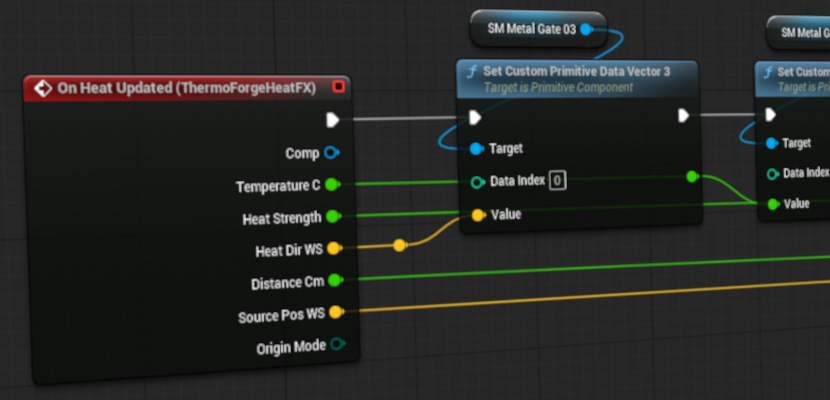

Demo material with custom data channels available under Resources **/Content/ThermoForgeFX_M**
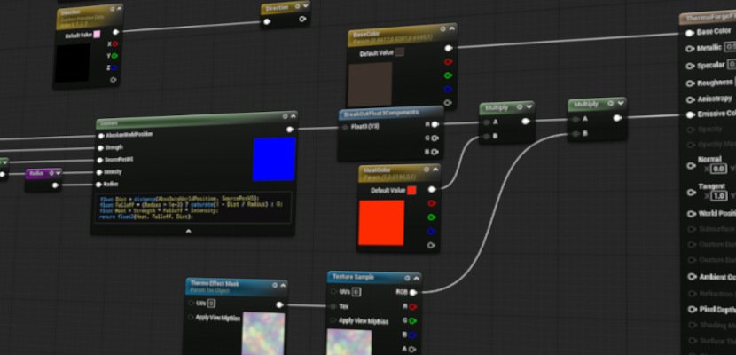

## What can I do with this plugin?

- **Environmental VFX** : Show shimmer particles above hot spots, frosty breath in cold pockets, or add post-process effects that lerp emissive/outline by (Temp − Ambient).
- **Status effects** : Trigger “Overheat” in >X °C areas (stagger, bloom, accuracy penalty) or “Comfort” near heat sources (stamina regen). Cold zones can slow reload but quiet footsteps for stealth.
- **Environmental puzzles & roguelite hooks** : Heat locks that open only above a threshold, ice bridges by chilling pipes, or time-of-day rooms flipping hot/cold for route planning choices.
- **Source/field synergies** : Use baked permeability for insulation gameplay: reduced heat damage behind thick walls, or explosive blasts venting down leaky corridors.
- **Elemental weapons** : Fire weapons spawn short-lived +°C bubbles, cryo weapons spawn −°C fields that suppress enemy thermal sense and fire-rate. Mods can alter falloff (Linear / None / InverseSquare) to reshape crowd control.
- **Faction and creature traits** : “Heat predators” track targets through smoke but struggle in uniformly hot rooms, while other AI can use thermal cues as senses you can disrupt.

## FAQ

<b>From which gameplay objects can I query temperature?</b>

> From any world position. You don’t need to attach a component to the object.  
> You can query directly from the Thermo Forge Subsystem or spawn a helper actor with a Heat Source component if you want to contribute new thermal data.

<b>How accurate are the thermal calculations?</b>

> Accuracy depends on the grid cell size of your Thermo Forge Volumes and the preview/bake settings.  
> For most gameplay purposes (AI senses, survival mechanics, ambient temperature), the results are stable and believable.  
> The system is designed for performance and consistency, not exact thermodynamics simulation.

<b>Does Thermo Forge simulate full thermodynamics?</b>

> No. Thermo Forge is not a scientific thermodynamics solver.  
> It is a hybrid approach: baked geometry fields plus runtime adjustments (climate, altitude, weather, and heat sources).  
> This makes it extremely fast and reliable for gameplay without heavy CPU/GPU load.

<b>Can I add or remove heat sources at runtime?</b>

> Yes. Heat Source Components can be attached or destroyed at runtime.  
> They automatically register with the Subsystem and immediately affect queries.

<b>How efficient is it in large open-world levels?</b>

> Very efficient.  
> Baking is done once per volume and stored in lightweight field assets.  
> Runtime queries are O(1) lookups into the nearest grid cell with minor adjustments.  
> It scales well with multiple volumes, even in large environments.

<b>Does it require physics assets or engine modifications?</b>

> No. Thermo Forge uses standard Unreal tracing and materials.  
> It does not depend on physics assets or engine modifications.  
> It can be dropped into any project as a self-contained plugin.

<b>Can AI use Thermo Forge for “heat sense” behaviors?</b>

> Yes. You can query the subsystem in AI controllers or behavior trees.  
> This enables AI to detect players or objects by heat signature instead of only vision.

<b>How do altitude and weather affect results?</b>

> Altitude reduces temperature using the environmental lapse rate.  
> Weather controls solar gain and affects how much heat from the sky reaches a location.  
> Both are configurable in Project Settings.

<b>Can I preview heat values in the editor?</b>

> Yes. Thermo Forge Volumes support grid previews and colored heat visualization.  
> Use the tab menu or volume details panel to rebuild, show, or hide previews.

<b>Is the system multiplayer/replication ready?</b>

> Thermo Forge itself runs on the server side by default.  
> Query results can be passed to clients like any other gameplay data.  
> Heat Sources are just components, so their replication depends on the owning actor.

## Planned  Upcoming Features

- ~~Per-volume bake queues with progress bars.~~
- ~~Thermal vision mode.~~
- Time scrubber on the Heat Previews.

## License

This plugin is under [MIT license](LICENSE).

MIT License does allow commercial use. You can use, modify, and distribute the software in a commercial product without any restrictions.

However, you must include the original copyright notice and disclaimers.

## *Support Me*

If you like my plugin, please do support me with a coffee.

